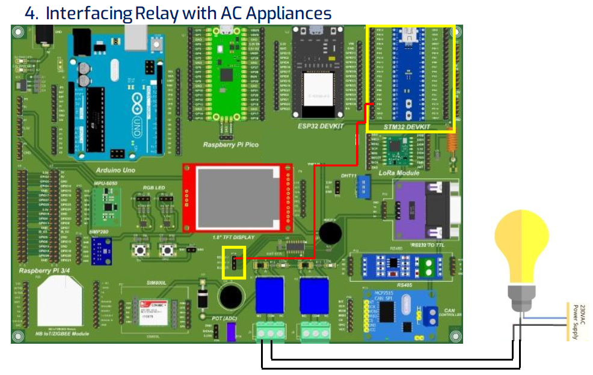

## Micro controller STM32 blue pill: Interfacing Relay with AC Appliances



```js
#define RELAY1 7

void setup() {
  // put your setup code here, to run once:
  pinMode(RELAY1, OUTPUT);
  Serial.begin(9600);
}

void loop() {
  // put your main code here, to run repeatedly:
  digitalWrite(RELAY1, HIGH); // turn the RELAY1 on (HIGH is the voltage level)
  Serial.println("RELAY1");
  delay(2000); // wait for a second

  digitalWrite(RELAY1, LOW); // turn the RELAY1 off by making the voltage LOW
  Serial.println("RELAY1");
  delay(2000); // wait for a second
}
```
