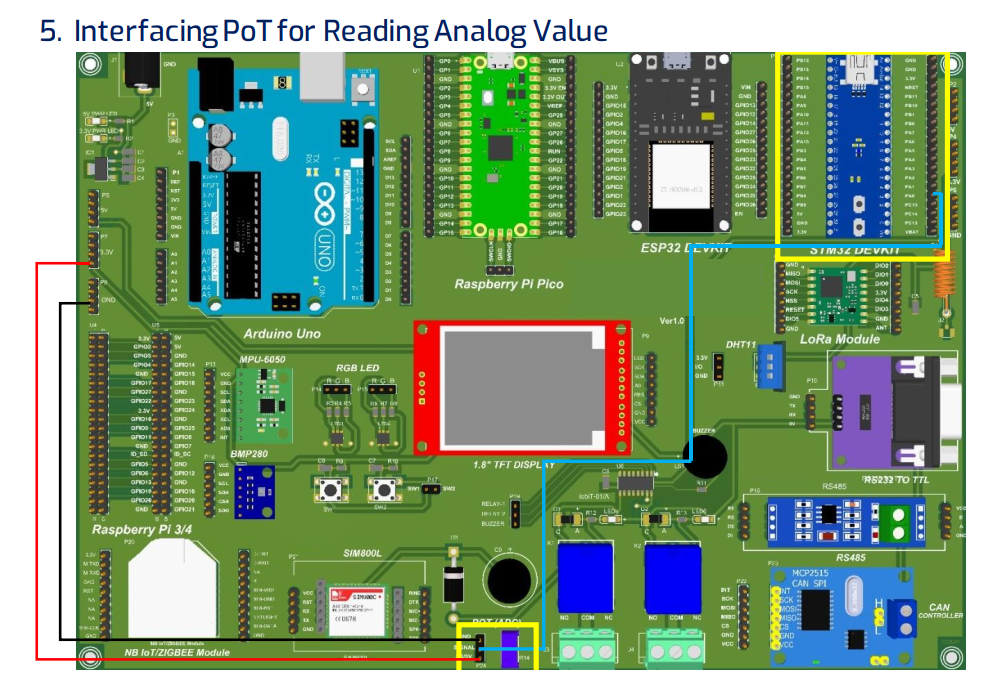

## Micro controller STM32 blue pill: Interfacing PoT for Reading Analog Value



```js
// Potentiometer is connected to GPIO 36 (Analog ADC1_CH6)
const int potPin = A0;
// variable for storing the potentiometer value
int potValue = 0;

void setup() {
  Serial.begin(9600);
  delay(1000);
}

void loop() {
  // Reading potentiometer value
  potValue = analogRead(potPin);
  Serial.print("potValue : ");
  Serial.println(potValue);
  delay(1000);
}
```
