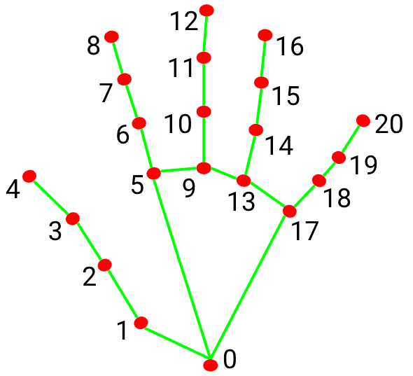

## Robot interface for vision data


### Creating a finger counter computer vision



1. Install library

```sh
pip install opencv-python mediapipe
```

2. code
```py
import cv2
import mediapipe as mp

mp_hand = mp.solutions.hands

# The Hands() takes 3 input: video mode or picture, number of hands, confidence
hands = mp_hand.Hands(static_image_mode=False,max_num_hands=1,min_detection_confidence=0.7)
mp_drawing= mp.solutions.drawing_utils

def count_finger(hand_landmarks):
    fingers =[]
    landmarks = hand_landmarks.landmark
    
    fingers.append(landmarks[4].x < landmarks[3].x)
    
    for tip in[8,12,16,20]:
        fingers.append(landmarks[tip].y < landmarks[tip -2].y)
    
    return fingers.count(True)

cap =cv2.VideoCapture(0)

while cap.isOpened():
    success, frame = cap.read()
    if not success:
        break
    
    frame =cv2.flip(frame,1)
    # convert bgr color to rgb format
    rgb_frame = cv2.cvtColor(frame,cv2.COLOR_BGR2RGB)
    
    result = hands.process(rgb_frame)
    if result.multi_hand_landmarks:
        for hand_landmarks in result.multi_hand_landmarks:
            mp_drawing.draw_landmarks(frame,hand_landmarks,mp_hand.HAND_CONNECTIONS)
            
            finger_count = count_finger(hand_landmarks)
            # put fingure counter text
            cv2.putText(frame,f"Fingers:{finger_count}",(10,70),cv2.FONT_HERSHEY_SIMPLEX,2,(255,0,0),2)
            
    cv2.imshow("Finger Counter",frame)
    
    if cv2.waitKey(1) & 0xFF == ord('q'):
        break
    
cap.release()
cv2.destroyAllWindows()
            
```
#### Documentation

- mediapipe demo [reference](https://mediapipe-studio.webapps.google.com/home)
- mediapipe library [reference](https://viso.ai/computer-vision/mediapipe/)

<br>


### 🔴 (not working on linux) Brightness control with hand Gesture

1. Install library

```sh
pip install mediapipe

pip install screen-brightness-control
```


2. code
```py
import cv2
import mediapipe as mp
import screen_brightness_control as sbc
from math import hypot
import numpy as np

mpHands = mp.solutions.hands
hands = mpHands.Hands(
	static_image_mode = False,
	model_complexity=1,
	min_detection_confidence=0.75,
	min_tracking_confidence=0.75,
	max_num_hands=2
)

Draw = mp.solutions.drawing_utils

cap = cv2.VideoCapture(0)

while True:
   _,frame = cap.read()
   frame =cv2.flip(frame,1)
   frameRGB = cv2.cvtColor(frame,cv2.COLOR_BGR2RGB)
   Process = hands.process(frameRGB)
   landmarkList= []
   
   if Process.multi_hand_landmarks:
       for handlm in Process.multi_hand_landmarks:
           for _id,landmarks in enumerate(handlm.landmark):
               height,width,color_channels = frame.shape
               x,y = int(landmarks.x * width) , int(landmarks.y * height)
               landmarkList.append([_id,x,y])
               
           Draw.draw_landmarks(frame,handlm,mpHands.HAND_CONNECTIONS)
           
   if landmarkList != []:
       
       x_1,y_1= landmarkList[4][1],landmarkList[4][2]
       x_2,y_2= landmarkList[8][1],landmarkList[8][2]
       
       cv2.circle(frame,(x_1,y_1),7,(0,255,0),cv2.FILLED)
       cv2.circle(frame,(x_2,y_2),7,(0,255,0),cv2.FILLED)
       cv2.line(frame,(x_1,y_1),(x_2,y_2),(0,255,0),3)
       
       L = hypot(x_2-x_1,y_2-y_1)
       
       b_level =np.interp(L,[15,220],[0,100])
       sbc.set_brightness(int(b_level))
       
   cv2.imshow("Image",frame)
   if cv2.waitKey(1) &0xff == ord('q'):
       break
```

#### Documentation

- screen-brightness-control library [reference](https://pypi.org/project/screen-brightness-control/)

<br>


### Car number plate detection

1. Download haarcascade_russian_plate_number file and save it in current working dir [click me](https://github.com/spmallick/mallick_cascades/blob/master/haarcascades/haarcascade_russian_plate_number.xml)

2. code

```py
import cv2

hercescad ="/home/joy/Pictures/haarcascade_russian_plate_number.xml"

cap = cv2.VideoCapture(0)

while True:
    succes, img= cap.read()
    
    plate_cascade = cv2.CascadeClassifier(hercescad)
    
    img_gray = cv2.cvtColor(img,cv2.COLOR_BGR2GRAY)
    
    plates = plate_cascade.detectMultiScale(img_gray,1.1,4)
    
    for (x,y,w,h) in plates:
        cv2.rectangle(img,(x,y),(x+w,y+h),(0,255,0),2)
        
    
    cv2.imshow("car Plate",img)
    
    if cv2.waitKey(1) & 0xFF == ord('q'):
        break
    
cap.release()
cv2.destroyAllWindows()
```


#### Documentation

- haarcascade_russian_plate_number [reference](https://github.com/spmallick/mallick_cascades/blob/master/haarcascades/haarcascade_russian_plate_number.xml)

<br>


### Car number plate detection and recognintion

```py

import cv2

hercescad ="/home/joy/Pictures/haarcascade_russian_plate_number.xml"

cap = cv2.VideoCapture(0)
count = 0

while True:
    succes, img= cap.read()
    
    plate_cascade = cv2.CascadeClassifier(hercescad)
    
    img_gray = cv2.cvtColor(img,cv2.COLOR_BGR2GRAY)
    
    plates = plate_cascade.detectMultiScale(img_gray,1.1,4)
    
    for (x,y,w,h) in plates:
        cv2.rectangle(img,(x,y),(x+w,y+h),(0,255,0),2)
        cv2.putText(img,"Number Plate",(x,y-5),cv2.FONT_HERSHEY_COMPLEX_SMALL,1,(255,0,255),2)
        img_roi = img[y:y+h, x:x+w]
        cv2.imshow("ROI",img_roi)
        
    
    cv2.imshow("car Plate",img)
    
    if cv2.waitKey(1) & 0xFF == ord('s'):
        cv2.imwrite("Plates/Car_plate" +str(count)+".jpg",img_roi)
        cv2.rectangle(img,(0,200),(640,300),(0,255,0),cv2.FILLED)
        cv2.putText(img,"Plate Saved",(150,265),cv2.FONT_HERSHEY_COMPLEX_SMALL,2,(0,0,255),2)
        cv2.imshow("Success",img)
        cv2.waitKey(500)
        count += 1
    if cv2.waitKey(1) & 0xFF == ord('q'):
        break
    
cap.release()
cv2.destroyAllWindows()
```

#### Documentation

- haarcascade_russian_plate_number [reference](https://github.com/spmallick/mallick_cascades/blob/master/haarcascades/haarcascade_russian_plate_number.xml)

<br>

### Right and left hand detection

```py
import cv2
import mediapipe as mp

# Initialize MediaPipe Hands
mp_hands = mp.solutions.hands
mp_drawing = mp.solutions.drawing_utils
hands = mp_hands.Hands(min_detection_confidence=0.5, min_tracking_confidence=0.5)

# Start Video Capture
cap = cv2.VideoCapture(0)

while cap.isOpened():
    ret, frame = cap.read()
    frame =cv2.flip(frame,1)
    if not ret:
        break

    # Convert BGR to RGB
    rgb_frame = cv2.cvtColor(frame, cv2.COLOR_BGR2RGB)
    results = hands.process(rgb_frame)

    if results.multi_hand_landmarks:
        for idx, hand_landmarks in enumerate(results.multi_hand_landmarks):
            hand_label = results.multi_handedness[idx].classification[0].label  # 'Left' or 'Right'

            # Draw Hand Landmarks
            mp_drawing.draw_landmarks(frame, hand_landmarks, mp_hands.HAND_CONNECTIONS)

            # Display Hand Type
            h, w, _ = frame.shape
            x, y = int(hand_landmarks.landmark[0].x * w), int(hand_landmarks.landmark[0].y * h)
            cv2.putText(frame, hand_label, (x, y - 20), cv2.FONT_HERSHEY_SIMPLEX, 1, (0, 255, 0), 2)

    # Show Output
    cv2.imshow("Hand Detection", frame)
    if cv2.waitKey(1) & 0xFF == ord('q'):
        break

cap.release()
cv2.destroyAllWindows()
```


#### Documentation

- haarcascade_russian_plate_number [reference](https://github.com/spmallick/mallick_cascades/blob/master/haarcascades/haarcascade_russian_plate_number.xml)

<br>


### Control mouse using openCV

1. Install library

```sh
pip install opencv-python mediapipe
pip install pyautogui
```


```py
import cv2
import mediapipe as mp
import 
import numpy as np

mp_hands = mp.solutions.hands
mp_drawing = mp.solutions.drawing_utils
hands = mp_hands.Hands(min_detection_confidence=0.7, min_tracking_confidence=0.7)


cap = cv2.VideoCapture(0)
screen_width, screen_height = pyautogui.size()

while cap.isOpened():
    ret,frame = cap.read()
    if not ret:
        break
    
    frame = cv2.flip(frame,1)
    h, w, c =frame.shape
    
    rgb_frame =cv2.cvtColor(frame, cv2.COLOR_BGR2RGB)
    results = hands.process(rgb_frame)
    
    if results.multi_hand_landmarks:
        for hand_landmarks in results.multi_hand_landmarks:
            index_finger_tip = hand_landmarks.landmark[mp_hands.HandLandmark.INDEX_FINGER_TIP]
            
            x = int(index_finger_tip.x * w)
            y = int(index_finger_tip.y * h)
            
            screen_x = np.interp(x, [0, w], [0, screen_width])
            screen_y = np.interp(y, [0, h], [0, screen_height])

            pyautogui.moveTo(screen_x, screen_y)  
            
            mp_drawing.draw_landmarks(frame, hand_landmarks, mp_hands.HAND_CONNECTIONS)
            
    cv2.imshow("DEMO", frame)
    if cv2.waitKey(1) & 0xFF == ord('q'):
        break
    
cap.release()
cv2.destroyAllWindows()
```


### Real time face mesh detection

```py
import cv2
import mediapipe as mp

# Initialize MediaPipe FaceMesh
mp_face_mesh = mp.solutions.face_mesh
face_mesh = mp_face_mesh.FaceMesh(static_image_mode=False, max_num_faces=1)

# Drawing utils
mp_drawing = mp.solutions.drawing_utils
mp_drawing_styles = mp.solutions.drawing_styles

# Start webcam capture

cap = cv2.VideoCapture(0)

while cap.isOpened():
    success, frame = cap.read()
    
    if not success:
        print("Ignoring empty camera frame.")
        continue
    
    frame = cv2.flip(frame,1)
    
    rgb_frame = cv2.cvtColor(frame, cv2.COLOR_BGR2RGB)
    
    # Process the image and find face mesh
    results = face_mesh.process(rgb_frame)
    
    # Draw the face mesh annotations on the image
    if results.multi_face_landmarks:
        for face_landmarks in results.multi_face_landmarks:
            mp_drawing.draw_landmarks(
                image=frame,
                landmark_list = face_landmarks,
                connections =mp_face_mesh.FACEMESH_TESSELATION,
                landmark_drawing_spec = None,
                connection_drawing_spec = mp_drawing_styles.get_default_face_mesh_tesselation_style()
            )
            
    cv2.imshow('Face Mesh',frame)
    
    
    if cv2.waitKey(1) & 0xFF ==ord('q'):
        break
    
cap.release()
cv2.destroyAllWindows()
        
```

### 